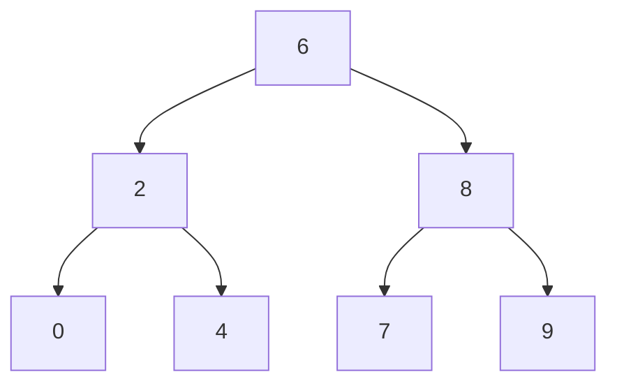

# LeetCode

## Binary Search Tree
 [Binary Search Tree - Lowest Common Ancestor of a Binary Tree](https://github.com/WhatNextAlgo/LeetCode/blob/main/LeetCode-50/BinarySearchTree/235.%20Lowest%20Common%20Ancestor%20of%20a%20Binary%20Search%20Tree.py)
```
class TreeNode:
    def __init__(self, x):
        self.val = x
        self.left = None
        self.right = None

class Solution:
    def lowestCommonAncestor(self, root: 'TreeNode', p: 'TreeNode', q: 'TreeNode') -> 'TreeNode':
        if root is None:
            return root
        first = p.val
        second = q.val
        def get_ancestor(root):
            val = root.val
            if val < min(first,second):
                return get_ancestor(root.right)
            if val > max(first,second):
                return get_ancestor(root.left)
            return root       

        return get_ancestor(root)     
```

