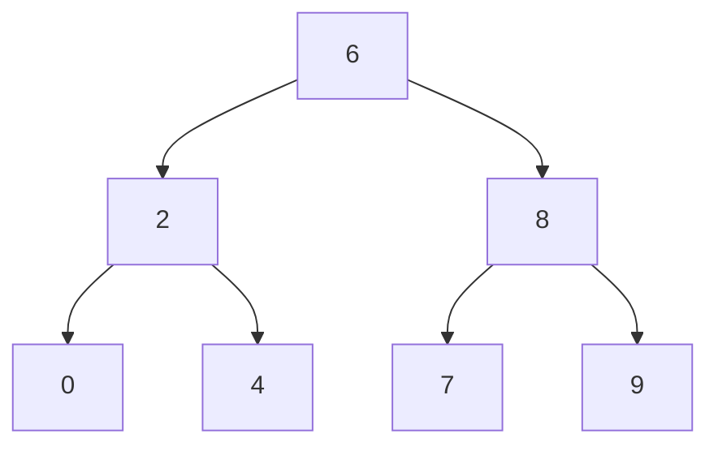

# LeetCode

## Binary Search Tree
 [Binary Search Tree - Lowest Common Ancestor of a Binary Tree](https://github.com/WhatNextAlgo/LeetCode/blob/main/LeetCode-50/BinarySearchTree/235.%20Lowest%20Common%20Ancestor%20of%20a%20Binary%20Search%20Tree.py)
 
 
 <details><summary>Click For Code :Lowest Common Ancestor of a Binary Tree </summary>
<p>
```
# Definition for a binary tree node.
class TreeNode:
    def __init__(self, x):
        self.val = x
        self.left = None
        self.right = None

class Solution:
    def lowestCommonAncestor(self, root: 'TreeNode', p: 'TreeNode', q: 'TreeNode') -> 'TreeNode':
        cur = root
        while cur:
            # p and q is greater the current val then we have to look at right sub tree.
            if p.val > cur.val and q.val > cur.val:
                cur = cur.right
            # p and q is less the current val then we have to look at left sub tree.
            elif p.val < cur.val and q.val < cur.val:
                cur = cur.left
            else:
                # if there is a split then split will be lowest common ancestor
                # or descendant of itself
                return cur
```

</p>
</details>
```

```

